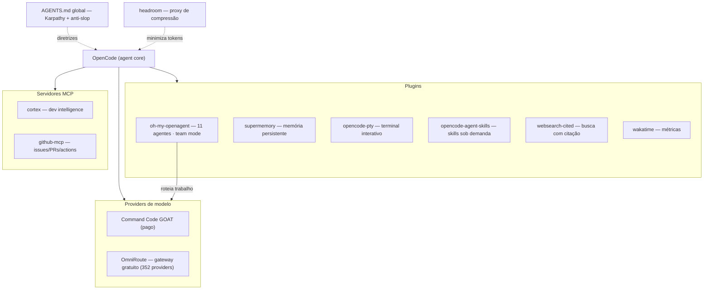

<div align="center">

# OpenCode Ultra Setup

**Meu setup do [OpenCode](https://opencode.ai) levado ao "ultra".** Um time de 11 agentes com team mode, memória persistente, compressão de contexto, terminal interativo, web search com citação, métricas, skills e diretrizes anti-slop.


<p align="center">
  <a href="#preview">Preview</a> ·
  <a href="#use-cases">Use Cases</a> ·
  <a href="#arquitetura">Arquitetura</a> ·
  <a href="#componentes">Componentes</a> ·
  <a href="#comecando">Começando</a> ·
  <a href="#seguranca">Segurança</a> ·
  <a href="#troubleshooting">Troubleshooting</a> ·
  <a href="#plano">Plano</a>
</p>

</div>

---

Documentação do meu setup do [OpenCode](https://opencode.ai) levado ao "ultra": em vez de reexplicar o projeto a cada sessão, o agente lembra do contexto (supermemory), comprime o que não importa (headroom), delega trabalho a um time de agentes especializados (oh-my-openagent) e consulta o codebase (Cortex) e o GitHub (MCP) sob demanda.

> **Status: em progresso** — vários componentes instalados e rodando, outros ainda em ajuste (ver [Plano](docs/plano.md)).

## Preview

```
❯ opencode

  ██ OpenCode Ultra Setup
  agentes      11 (team mode) · ultrawork
  memória      supermemory (persistente entre sessões)
  contexto     headroom (compressão ~20–57%)
  mcp          cortex · github
  providers    omniroute (gateway) · goat (planejado)

  /goal "refatorar o módulo de billing"
  → 11 agentes em paralelo (Sisyphus orquestra, Momus revisa, ...)
  → contexto regenerado a cada sessão, sem reexplicar o projeto
```

## Use Cases

O que esse setup permite fazer com o OpenCode:

- **Trabalho em time** — `ultrawork`/`ulw` dispara 11 agentes em paralelo com team mode, cada um apontado para o modelo certo (caro para deep work, barato para utilidades).
- **Memória persistente** — o agente lembra de decisões e convenções do projeto entre sessões (supermemory).
- **Contexto enxuto** — o proxy headroom comprime o contexto em até ~57% antes de mandar pro modelo, sem perder linhas críticas.
- **Terminal de verdade** — dev servers e REPLs rodam em background real com `opencode-pty`.
- **Pesquisa com fonte** — web search com citação inline e URL da fonte.
- **Dev intelligence** — Cortex indexa o codebase: busca semântica, grafo de dependências, memória de projeto, planner e code review via CLI + MCP.
- **Automação GitHub** — issues, PRs, código, Actions e CI direto do agente via MCP GitHub.
- **Qualidade honesta** — diretrizes Karpathy + anti-slop no `AGENTS.md` global para evitar overengineering e slop.
- **Métricas** — wakatime mede quanto o agente codeja (linhas, horas, modelo usado).

## Arquitetura



## Componentes

| Componente | Projeto original | O que faz | Status |
|---|---|---|---|
| [oh-my-openagent](docs/oh-my-openagent.md) | [code-yeongyu/oh-my-openagent](https://github.com/code-yeongyu/oh-my-openagent) | 11 agentes (Sisyphus, Hephaestus, Oracle, Atlas, Metis, Momus, ...) com **Team Mode** e `ultrawork` | ✅ instalado |
| [opencode-agent-skills](docs/agent-skills.md) | [joshuadavidthomas/opencode-agent-skills](https://github.com/joshuadavidthomas/opencode-agent-skills) | skills reutilizáveis, carregadas sob demanda | ✅ instalado |
| [opencode-supermemory](docs/supermemory.md) | [supermemoryai/opencode-supermemory](https://github.com/supermemoryai/opencode-supermemory) | memória persistente entre sessões | ✅ autenticado |
| [headroom](docs/headroom.md) | [headroomlabs-ai/headroom](https://github.com/headroomlabs-ai/headroom) | comprime o contexto em até ~57% antes de mandar pro modelo | ⏳ proxy em ajuste |
| [opencode-pty](docs/pty.md) | [shekohex/opencode-pty](https://github.com/shekohex/opencode-pty) | terminal interativo (dev server em background real) | ✅ instalado |
| [opencode-websearch-cited](docs/websearch-cited.md) | [ghoulr/opencode-websearch-cited](https://github.com/ghoulr/opencode-websearch-cited) | busca web com citação e fonte | ✅ instalado |
| [opencode-wakatime](docs/wakatime.md) | [angristan/opencode-wakatime](https://github.com/angristan/opencode-wakatime) | métricas de quanto o agente codeja | ⏳ falta API key |
| [OmniRoute](docs/omniroute.md) | [diegosouzapw/OmniRoute](https://github.com/diegosouzapw/OmniRoute) | AI gateway gratuito (352 providers, auto-fallback, compressão) | ✅ gateway no ar |
| [AGENTS.md (Karpathy + anti-slop)](docs/agentes.md) | [multica-ai/andrej-karpathy-skills](https://github.com/multica-ai/andrej-karpathy-skills) · [peakoss/anti-slop](https://github.com/peakoss/anti-slop) | diretrizes globais pro agente não fazer overengineering | ✅ ativo |
| [Command Code GOAT](docs/plano.md) | [commandcode.ai](https://commandcode.ai) | provider de API (GPT-5.6 Sol, GLM 5.2, Kimi K2.7 Code, DeepSeek V4 Flash) | 🎯 planejado |
| [Cortex](docs/cortex.md) | [benogoulart/Cortex](https://github.com/benogoulart/Cortex) | developer intelligence — indexa o codebase, grafo de dependências, busca semântica, memória de projeto, code review e planner via CLI + MCP | ✅ instalado |
| [MCP GitHub](docs/github-mcp.md) | [github/github-mcp-server](https://github.com/github/github-mcp-server) | MCP local para issues/PRs, código, Actions e automação do GitHub | ✅ instalado |
| [awesome-opencode](docs/awesome-opencode.md) | [awesome-opencode/awesome-opencode](https://github.com/awesome-opencode/awesome-opencode) | referência de projetos/recursos para OpenCode (não é plugin) | 📋 referência |

## Começando

1. Instale o [OpenCode](https://opencode.ai).
2. Siga os passos de instalação de cada componente nos docs acima (links na tabela de [Componentes](#componentes)).
3. Referencie o `AGENTS.md` global com as diretrizes de qualidade.
4. Confira o que ainda falta em [Pendências do setup](docs/plano.md#pendências-do-setup).

## Arquivos de config

Os arquivos que compõem o setup ficam locais (não versionados — ver [Segurança](#seguranca); conteúdos sanitizados, sem keys):

| Arquivo | Conteúdo |
|---|---|
| `config/opencode.jsonc` | plugins, providers, permissões, MCPs |
| `config/omo.jsonc` | agentes/teams do oh-my-openagent |
| `config/supermemory.jsonc` | memória persistente |
| `config/start-headroom.ps1` | launcher do proxy headroom |
| `config/AGENTS.md` | diretrizes globais |

## Segurança

Boas práticas para não vazar credenciais (espelhadas nas do [GitHub MCP Server](https://github.com/github/github-mcp-server)):

- **Nunca commitar secretos.** API keys, tokens e configs locais com secrets ficam fora do repo (`.gitignore` com `config/*.local.jsonc`, `**/.env`, `**/.wakatime.cfg`). Adicione apenas os arquivos de exemplo.
- **Mínimos privilégios.** Use tokens com apenas os escopos necessários (ex.: PAT do GitHub com `repo` — não use token de conta total).
- **Rotação.** Troque tokens periodicamente e use um token por ambiente/projeto.
- **Preferir variáveis de ambiente** a tokens hardcoded no config sempre que o host suportar (ex.: OpenCode usa `environment` no MCP).
- **Cuidado com fluxos de auth.** O dashboard do supermemory às vezes trava no "Loading workspaces…" (ver [Troubleshooting](#troubleshooting)).

## Troubleshooting

Problemas conhecidos e a solução que funcionou — detalhes em cada doc:

- **Windows:** `pnpm link --global` pode criar shims quebrados. Solução: criar `cortex.cmd` e `cortex-mcp.cmd` manuais apontando pro `dist` (ver [cortex.md](docs/cortex.md)).
- **Windows/npm:** scripts pós-instalação bloqueados em pacotes com `allow-scripts` quebrado (OmniRoute). Solução: `npm config set allow-scripts=...` (ver [omniroute.md](docs/omniroute.md)).
- **supermemory:** dashboard do console às vezes trava no "Loading workspaces…". Solução: janela anônima ou relançar `login` (ver [supermemory.md](docs/supermemory.md)).
- **headroom:** proxy com timeout no health `http://127.0.0.1:8787/health` (ver [headroom.md](docs/headroom.md)).

## Plano

Próximos passos, pendências e roteamento planejado de modelos → [docs/plano.md](docs/plano.md).

## Projetos avaliados e não usados

| Projeto | Motivo |
|---|---|
| [thedotmack/claude-mem](https://github.com/thedotmack/claude-mem) | Redundante com o supermemory |
| [anthropics/claude-plugins-official](https://github.com/anthropics/claude-plugins-official) | Plugins para Claude Code, não OpenCode |