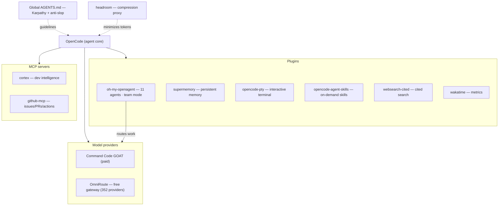

<div align="center">

# OpenCode Ultra Setup

**My [OpenCode](https://opencode.ai) setup taken to the "ultra".** A team of 11 agents with team mode, persistent memory, context compression, a real interactive terminal, web search with citations, metrics, skills, and anti-slop guidelines.


<p align="center">
  <a href="#preview">Preview</a> ·
  <a href="#use-cases">Use Cases</a> ·
  <a href="#architecture">Architecture</a> ·
  <a href="#components">Components</a> ·
  <a href="#getting-started">Getting Started</a> ·
  <a href="#security">Security</a> ·
  <a href="#troubleshooting">Troubleshooting</a> ·
  <a href="#plan">Plan</a>
</p>

</div>

---

Documentation of my [OpenCode](https://opencode.ai) setup taken to the "ultra": instead of re-explaining the project to every session, the agent remembers context (supermemory), compresses what doesn't matter (headroom), delegates work to a team of specialized agents (oh-my-openagent), and queries your codebase (Cortex) and GitHub (MCP) on demand.

> **Status: in progress** — several components installed and running, others still being tuned (see [Plan](docs/plano.md)).

## Preview

```
❯ opencode

  ██ OpenCode Ultra Setup
  agents       11 (team mode) · ultrawork
  memory       supermemory (persistent across sessions)
  context      headroom (compression ~20–57%)
  mcp          cortex · github
  providers    omniroute (gateway) · goat (planned)

  /goal "refactor the billing module"
  → 11 agents in parallel (Sisyphus orchestrates, Momus reviews, ...)
  → context rebuilt every session, no need to re-explain the project
```

## Use Cases

What this setup allows you to do with OpenCode:

- **Team work** — `ultrawork`/`ulw` fires 11 agents in parallel with team mode, each pointed at the right model (expensive for deep work, cheap for utilities).
- **Persistent memory** — the agent remembers project decisions and conventions across sessions (supermemory).
- **Lean context** — the headroom proxy compresses context up to ~57% before sending it to the model, without losing critical lines.
- **Real terminal** — dev servers and REPLs run in real background with `opencode-pty`.
- **Sourced search** — web search with inline citations and source URLs.
- **Dev intelligence** — Cortex indexes the codebase: semantic search, dependency graph, project memory, planner, and code review via CLI + MCP.
- **GitHub automation** — issues, PRs, code, Actions, and CI straight from the agent via the GitHub MCP.
- **Honest quality** — Karpathy + anti-slop guidelines in the global `AGENTS.md` to avoid overengineering and slop.
- **Metrics** — wakatime measures how much the agent codes (lines, hours, model used).

## Architecture



## Components

| Component | Original project | What it does | Status |
|---|---|---|---|
| [oh-my-openagent](docs/oh-my-openagent.md) | [code-yeongyu/oh-my-openagent](https://github.com/code-yeongyu/oh-my-openagent) | 11 agents (Sisyphus, Hephaestus, Oracle, Atlas, Metis, Momus, ...) with **Team Mode** and `ultrawork` | ✅ installed |
| [opencode-agent-skills](docs/agent-skills.md) | [joshuadavidthomas/opencode-agent-skills](https://github.com/joshuadavidthomas/opencode-agent-skills) | reusable skills loaded on demand | ✅ installed |
| [opencode-supermemory](docs/supermemory.md) | [supermemoryai/opencode-supermemory](https://github.com/supermemoryai/opencode-supermemory) | persistent memory across sessions | ✅ authenticated |
| [headroom](docs/headroom.md) | [headroomlabs-ai/headroom](https://github.com/headroomlabs-ai/headroom) | compresses context up to ~57% before sending it to the model | ⏳ proxy being tuned |
| [opencode-pty](docs/pty.md) | [shekohex/opencode-pty](https://github.com/shekohex/opencode-pty) | interactive terminal (real background dev server) | ✅ installed |
| [opencode-websearch-cited](docs/websearch-cited.md) | [ghoulr/opencode-websearch-cited](https://github.com/ghoulr/opencode-websearch-cited) | web search with citation and source | ✅ installed |
| [opencode-wakatime](docs/wakatime.md) | [angristan/opencode-wakatime](https://github.com/angristan/opencode-wakatime) | metrics of how much the agent codes | ⏳ API key missing |
| [OmniRoute](docs/omniroute.md) | [diegosouzapw/OmniRoute](https://github.com/diegosouzapw/OmniRoute) | free AI gateway (352 providers, auto-fallback, compression) | ✅ gateway up |
| [AGENTS.md (Karpathy + anti-slop)](docs/agentes.md) | [multica-ai/andrej-karpathy-skills](https://github.com/multica-ai/andrej-karpathy-skills) · [peakoss/anti-slop](https://github.com/peakoss/anti-slop) | global guidelines so the agent avoids overengineering | ✅ active |
| [Command Code GOAT](docs/plano.md) | [commandcode.ai](https://commandcode.ai) | API provider (GPT-5.6 Sol, GLM 5.2, Kimi K2.7 Code, DeepSeek V4 Flash) | 🎯 planned |
| [Cortex](docs/cortex.md) | [benogoulart/Cortex](https://github.com/benogoulart/Cortex) | developer intelligence — indexes the codebase, dependency graph, semantic search, project memory, code review, and planner via CLI + MCP | ✅ installed |
| [GitHub MCP](docs/github-mcp.md) | [github/github-mcp-server](https://github.com/github/github-mcp-server) | local MCP for issues/PRs, code, Actions, and GitHub automation | ✅ installed |
| [awesome-opencode](docs/awesome-opencode.md) | [awesome-opencode/awesome-opencode](https://github.com/awesome-opencode/awesome-opencode) | reference of projects/resources for OpenCode (not a plugin) | 📋 reference |

## Getting Started

1. Install [OpenCode](https://opencode.ai).
2. Follow each component's installation steps in the docs above (links in the [Components](#components) table).
3. Reference the global `AGENTS.md` with the quality guidelines.
4. Check what's still pending in [Setup pending items](docs/plano.md#setup-pending-items).

## Config files

The files that make up the setup live locally (not versioned — see [Security](#security); contents sanitized, no keys):

| File | Contents |
|---|---|
| `config/opencode.jsonc` | plugins, providers, permissions, MCPs |
| `config/omo.jsonc` | oh-my-openagent agents/teams |
| `config/supermemory.jsonc` | persistent memory |
| `config/start-headroom.ps1` | headroom proxy launcher |
| `config/AGENTS.md` | global guidelines |

## Security

Best practices to avoid leaking credentials (mirrored from the [GitHub MCP Server](https://github.com/github/github-mcp-server)):

- **Never commit secrets.** API keys, tokens, and local configs with secrets stay out of the repo (`.gitignore` with `config/*.local.jsonc`, `**/.env`, `**/.wakatime.cfg`). Add only the example files.
- **Least privilege.** Use tokens with only the scopes you need (e.g., GitHub PAT with `repo` — don't use an account-wide token).
- **Rotation.** Rotate tokens periodically and use one token per environment/project.
- **Prefer environment variables** over hardcoded tokens in the config whenever the host supports it (e.g., OpenCode uses `environment` in MCP).
- **Watch out for auth flows.** The supermemory dashboard sometimes hangs on "Loading workspaces…" (see [Troubleshooting](#troubleshooting)).

## Troubleshooting

Known issues and the workaround that worked — details in each doc:

- **Windows:** `pnpm link --global` may create broken shims. Fix: create `cortex.cmd` and `cortex-mcp.cmd` manually pointing to `dist` (see [cortex.md](docs/cortex.md)).
- **Windows/npm:** blocked post-install scripts with broken `allow-scripts` (OmniRoute). Fix: `npm config set allow-scripts=...` (see [omniroute.md](docs/omniroute.md)).
- **supermemory:** the console dashboard sometimes hangs on "Loading workspaces…". Fix: incognito window or re-run `login` (see [supermemory.md](docs/supermemory.md)).
- **headroom:** proxy timeouts on health `http://127.0.0.1:8787/health` (see [headroom.md](docs/headroom.md)).

## Plan

Next steps, pending items, and planned model routing → [docs/plano.md](docs/plano.md).

## Evaluated projects not used

| Project | Reason |
|---|---|
| [thedotmack/claude-mem](https://github.com/thedotmack/claude-mem) | Redundant with supermemory |
| [anthropics/claude-plugins-official](https://github.com/anthropics/claude-plugins-official) | Plugins for Claude Code, not OpenCode |